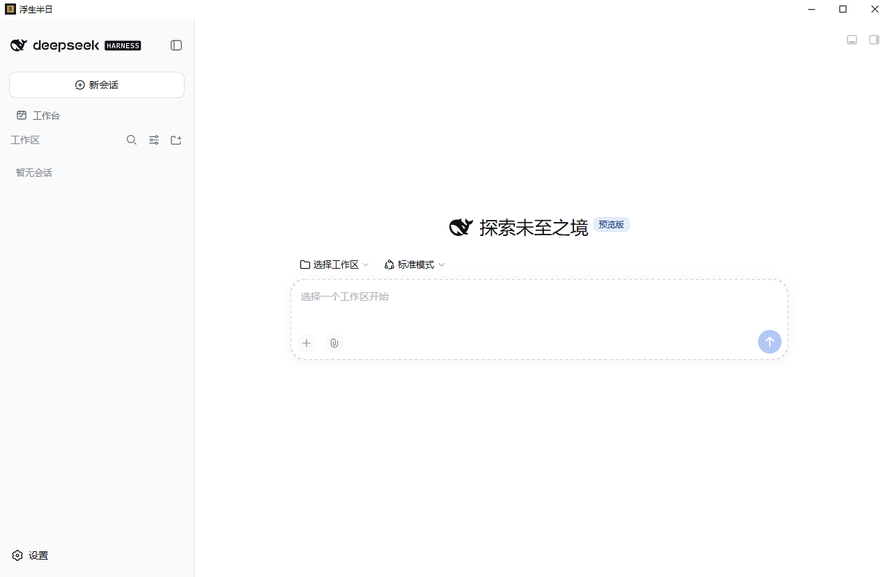
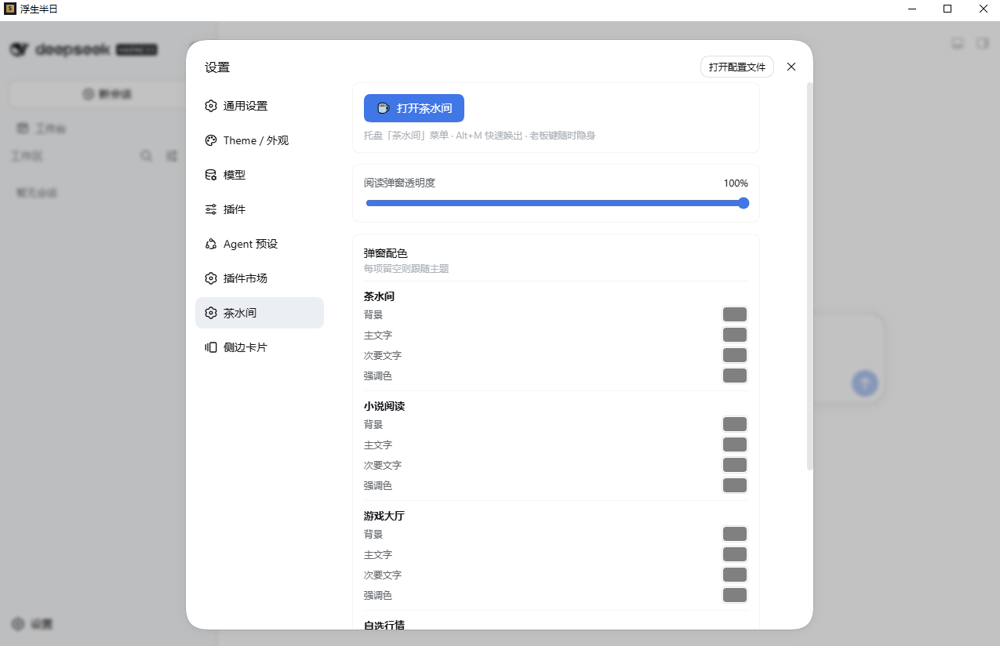
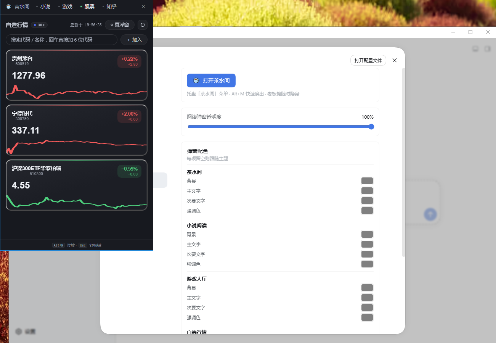
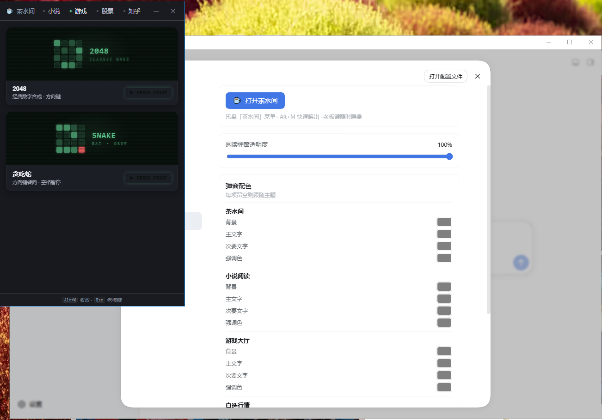
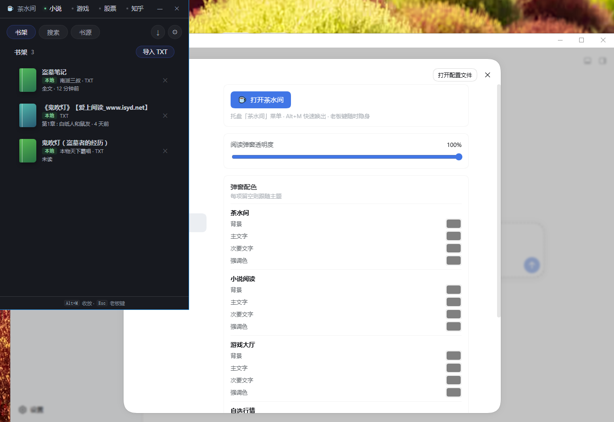
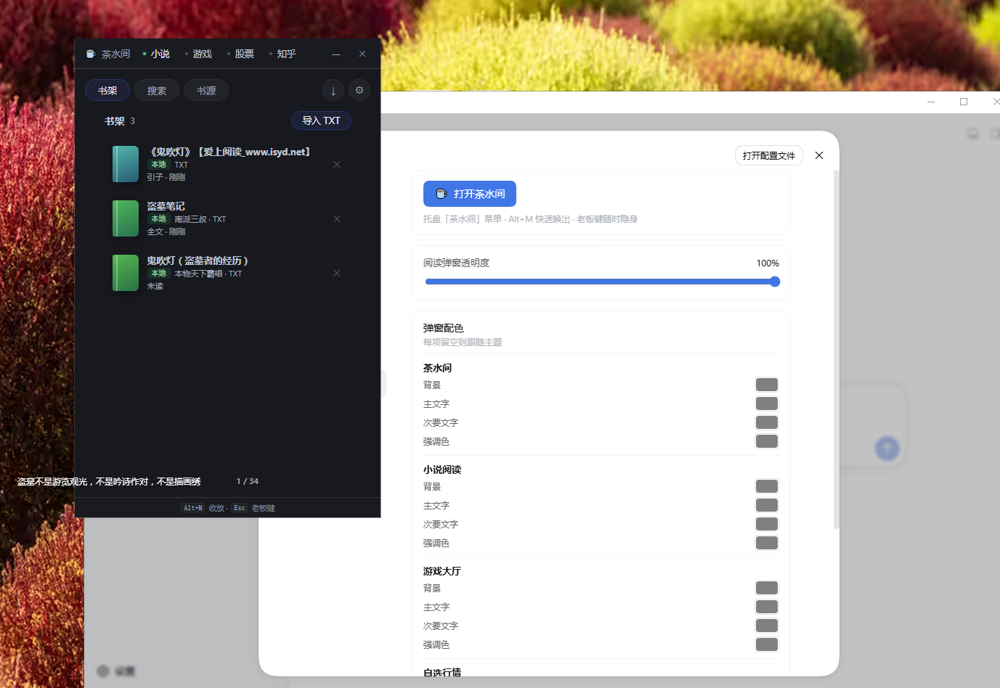

# Slacker Hero — dsh 桌面 Agent 工作台 + 摸鱼五件套

以 [dsh (DeepSeek Harness)](https://github.com/deepseek-ai/deepseek-harness) 为 Agent 运行基座的 Tauri 2 桌面壳,一个半透明小窗装下 **AI Agent 工作台** 与摸鱼日常:**茶水间 + 股票行情 + 小说阅读器 + 知乎摸鱼 + 贪吃蛇/2048**。

---

## Agent 基座:dsh (DeepSeek Harness)

- [dsh](https://github.com/deepseek-ai/deepseek-harness) 是 DeepSeek 官方开源的 Agent Harness(npm 包 [`@deepseek-ai/dsh`](https://www.npmjs.com/package/@deepseek-ai/dsh)),提供 Agent 会话、工具调用、Web 工作台等完整能力
- 内核为 **Cordis 插件化架构**,一切能力(基础运行时、Web UI、第三方扩展)均以 plugin/bundle 形式按序装载
- 本项目以 npm 壳包方式锁定运行时版本 **0.1.5-rc.2**(`vendor/dsh-runtime/package.json`,node_modules 本地安装,不入库)

---

## 在 dsh 之上增强了什么

| 增强 | 说明 |
|------|------|
| **Tauri 2 桌面壳** | 半透明无边框窗口、老板键 (Ctrl+Shift+H) 秒隐藏、桌面置顶悬浮窗;dsh 进程生命周期管理(启动/自动重启/退出清理) |
| **启动自动化** | 首启自动把 profile 模板同步到 dsh home、自动 `pnpm install` 装插件依赖、junction 共享本地插件;从 dsh stdout 解析 token URL,免手动复制直接注入窗口 |
| **slacker profile** | 声明式 bundle 清单(`shell/dsh-profile/slacker/`):dsh 基础包 + Web UI + 第三方插件 + 本项目自有插件,版本由 pnpm-lock 锁定 |
| **novel 插件** | 小说阅读器,随 slacker profile 安装(见下方功能表) |
| **ui-slacker 插件** | 茶水间/股票/知乎/迷你游戏,同时以 UMD 方式注入独立透明窗口(见下方功能表) |

### slacker profile 内置的第三方插件

以下社区插件通过 profile 的 bundle 清单一并装载(版本由 `pnpm-lock.yaml` 锁定):

| 插件 | 作者 | 说明 |
|------|------|------|
| **dsh-better-sidebar** | 社区 | VSCode 式右侧边栏:资源管理器 / 编辑器 / 终端 / Git / 浏览器,按会话隔离;开放 service 供其他插件注册侧栏标签页与文件查看器 |
| **@dely0/dsh-personal-workbench** | [dely0](https://www.npmjs.com/package/@dely0/dsh-personal-workbench) | 个人工作台:日历 + 层级任务 + AI 澄清/拆解/执行/复盘 + AI 智能排序/日报周报 + 桌面提醒 |
| **dshmarket** | 社区 | DSH 可视化插件市场:浏览、搜索、一键安装社区插件 |
| **dsh-dream-skin** | 社区 | 换肤插件:8 套 iOS / Linear 式清透冷调主题 + 弥散光壁纸 + 每皮肤智能背景与强调色,支持主题包分享 |

---

## 功能

| 模块 | 说明 |
|------|------|
| **AI Agent 工作台** | dsh Web UI 内嵌主窗,插件化扩展生态 |
| **茶水间** | 独立无边框透明窗口,老板键 (Ctrl+Shift+H) 秒隐藏 |
| **股票行情** | 自选列表、搜索加自选、K 线详情 (手写 SVG 蜡烛图)、桌面置顶悬浮窗 |
| **小说阅读器** | 本地 TXT 书架、章节切分、进度持久化、网络书源阅读;仓库根目录内置 [`legado-book-sources.json`](./legado-book-sources.json) (Legado 社区书源合集),在「书源」页选择该文件导入(自动识别 Legado 格式并转换)即可在线搜书 |
| **知乎摸鱼** | 推荐流卡片阅读,Cookie 登录(Cookie 与浏览器头由 Rust 侧代理注入,不落前端),四层去重防重复推送,正文分段就地展开,图片默认不发请求(摸鱼特性) |
| **迷你游戏** | 贪吃蛇、2048,分数本地存储 |

数据源为东方财富公开接口,全链路 HTTPS + GB18030 自动转码。

## 界面预览

| 主窗 · Agent 工作台 | 设置 · 弹窗配色 |
|:---:|:---:|
|  |  |
| **茶水间 · 股票自选** | **茶水间 · 迷你游戏** |
|  |  |
| **茶水间 · 小说书架** | **小说悬浮框 · 桌面摸鱼** |
|  |  |

---

## 快速开始

### 环境

- Node.js ≥ 22 (dsh 官方未强制 engines,本项目开发验证于 v22.23)
- pnpm ≥ 10 (插件 workspace)
- Rust 稳定版 (Windows 建议 MSVC)
- Tauri 2 前置:WebView2、Visual Studio Build Tools

### 首次安装

```bash
npm run setup                          # 根装 @tauri-apps/cli → 两个插件各自 pnpm install + bundle → 同步独立窗口资源到 shell/ui/
cd vendor/dsh-runtime && npm install   # 安装 dsh 运行时 (@deepseek-ai/dsh 0.1.5-rc.2)
cd ../..
```

### 运行

```bash
npm run shell        # 开发模式 (tauri dev)
cd shell && cargo build --release   # 生产构建
```

首次启动会自动创建 dsh home、同步 profile 并安装插件依赖,无需手动干预。

详细文档见 [`SHELL_README.md`](./SHELL_README.md)。

---

## 目录结构

```
slacker-hero/
├── package.json              # 根脚本: setup / shell
├── SHELL_README.md           # 完整开发文档
├── legado-book-sources.json  # 小说默认书源数据 (Legado 格式,阅读器「书源」页导入即用)
├── shell/
│   ├── src-tauri/            # Rust 后端 (dsh 进程管理、slacker_* 命令、窗口、快捷键)
│   │   └── resources/        # 独立窗口 HTML + React UMD vendor + 启动 splash
│   ├── dsh-profile/
│   │   └── slacker/          # dsh profile 模板 (bundle 清单 + 插件依赖)
│   ├── plugins/
│   │   ├── ui-slacker/       # 茶水间/股票/知乎/游戏 前端 (tsdown)
│   │   └── novel/            # 小说阅读器前端 (tsdown)
│   ├── scripts/
│   │   └── standalone-assets.cjs  # 同步 HTML/JS → shell/ui/
│   └── ui/                   # 运行时资源 (自动生成,不入库)
└── vendor/
    └── dsh-runtime/          # dsh 运行时锚点 (npm 壳包 0.1.5-rc.2)
```

---

## 技术栈

- **dsh (@deepseek-ai/dsh)** — Agent Harness 基座,Cordis 插件化内核
- **Tauri 2** (Rust + WebView2) — 桌面壳与窗口管理
- **React 18** (UMD,零打包依赖) — 独立窗口前端
- **tsdown (Rolldown)** — 多入口打包
- **reqwest + native-tls** — Windows SChannel,东财接口安全请求
- **encoding_rs** — GB18030 自动解码

---

## 许可证

[AGPL-3.0](./LICENSE)
